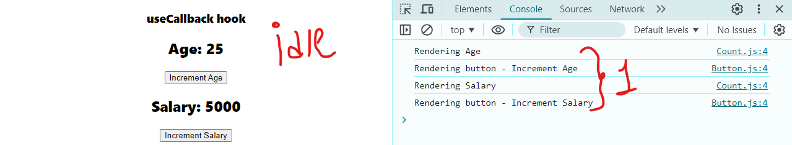
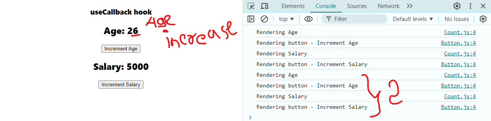
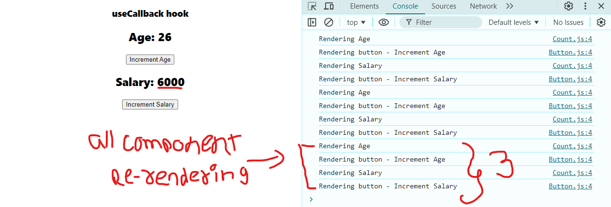

This folder has 1 parent-component & 3 sub-components inside it.

>ParentComponent.js
>> - Button.js
>> - Count.js
>> - Title.js
---

when render the one component by event like a trigger, all the sub-components get re-rendered.

---

--

although this seems fine becuase its just 3 components re-rendering but when we have more than 10 component, which will re-render themselve each event it will kill the app optimization 

---